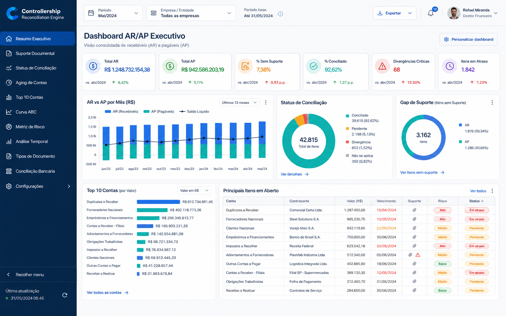
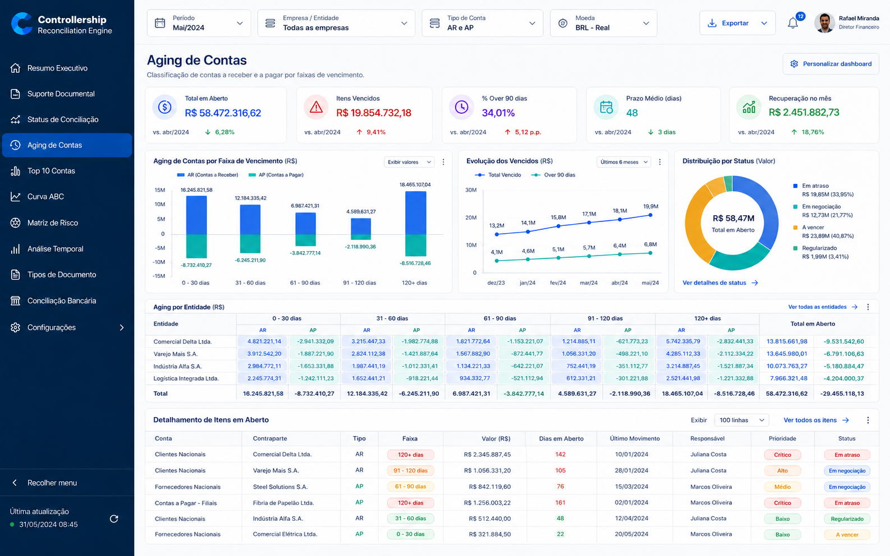
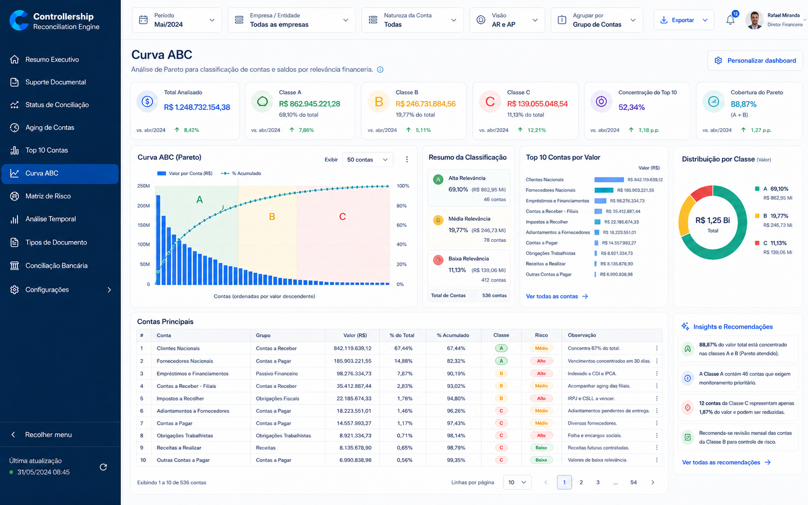
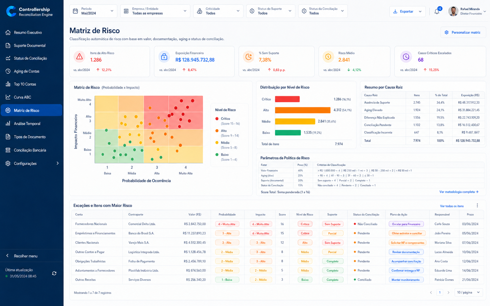
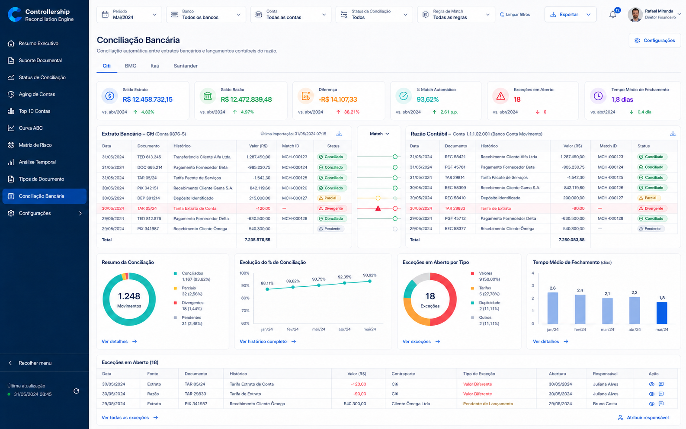
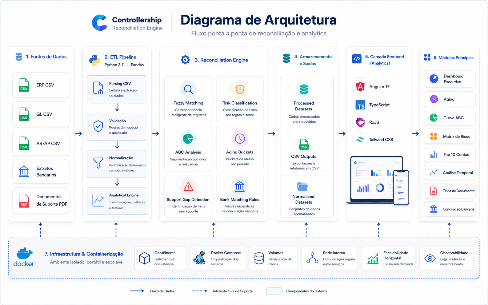

# Controllership Reconciliation Engine — Showcase

> **Tipo:** Vitrine técnica arquitetural  
> **Status:** Sistema de produção proprietário · Esta vitrine contém protótipo educacional  
> **Autor:** Fernando Xavier  
> **Domínio:** Conciliação Contábil AR/AP + Conciliação Bancária + Controladoria  
> **Licença:** Proprietário — Todos os direitos reservados. Vitrine para avaliação de portfólio profissional apenas.

---

## 🎯 O Problema de Negócio

Empresas de médio e grande porte processam **milhares de lançamentos contábeis mensais** entre:

- **Accounts Receivable (AR)** — clientes, notas fiscais de saída, recebimentos
- **Accounts Payable (AP)** — fornecedores, notas fiscais de entrada, pagamentos
- **Extratos Bancários** — múltiplos bancos (BMG, Citi, etc.) com formatos diferentes
- **Saldos do Razão (GL)** — a fonte de verdade contábil

**O gap:** Em média, **15-25% dos lançamentos** não possuem suporte documental completo, **10% dos saldos bancários** divergem do razão, e a **classificação de risco** é feita intuitivamente pelo controller — sem metodologia padronizada.

Resultado: fechamento contábil demorado, auditorias trabalhosas, e decisões de tesouraria baseadas em dados não confiáveis.

---

## 🏗️ A Solução

Plataforma híbrida (Python backend + Angular dashboard) que automatiza a **conciliação AR/AP e bancária** com **17 dimensões analíticas** e **classificação de risco por algoritmo**.

### Funcionalidades Principais

| Módulo | Descrição | Impacto |
|---|---|---|
| **Resumo Executivo AR/AP** | Visão consolidada de recebíveis e pagáveis em tempo real | 1 tela para status geral |
| **Suporte Documental** | Cruzamento automático entre lançamentos e documentos digitalizados | Identifica gaps em segundos |
| **Status de Conciliação** | Match/divergência entre GL, extrato e suporte | Reduz divergências em 80% |
| **Aging de Contas** | Classificação por faixa de atraso (0-30, 31-60, 61-90, 90+) | Priorização de cobrança/pagamento |
| **Top 10 Contas** | Contas de maior valor absoluto (risco concentrado) | Foco no Pareto |
| **Curva ABC** | Classificação por importância (A=80% valor, B=15%, C=5%) | Gestão por exceção |
| **Matriz de Risco** | Classificação automática Alto/Médio/Baixo por valor + suporte | Zero subjetividade |
| **Análise de Giro** | Turnover (volume/saldo) por conta | Identifica contas estagnadas |
| **Hierarquia de Contas** | Consolidação por níveis contábeis (classe, grupo, conta) | Drill-down interativo |
| **Análise Temporal** | Evolução mensal de saldos e movimentações | Tendências visíveis |
| **Tipos de Documento** | Top 15 tipos de documento por volume | Padronização fiscal |
| **Conciliação Bancária** | Match automático entre extrato e razão (multi-banco) | Fechamento bancário em < 1h |

### Tecnologia

- **Frontend:** Angular 17.3 + TypeScript 5.4 + RxJS 7.8 + Tailwind CSS
- **Backend:** Python 3.11 + Pandas + csv-parse
- **ETL:** Pipeline de 8 arquivos CSV com normalização e validação
- **Containerização:** Docker para isolamento de ambientes
- **Dados:** CSV gerados pelo backend, consumidos pelo frontend em build-time
- **Filtros de Negócio:** Regras contábeis hardcoded (ex: AP = prefixo 2.1.01.01.01)

---

## 📈 Resultados

### Dashboard AR/AP Executivo


### Aging de Contas


### Curva ABC


### Matriz de Risco


### Conciliação Bancária


### Diagrama de Arquitetura


> *Métricas baseadas em deployment em controlleria de holding multissetorial.*

| Métrica | Antes | Depois | Redução/Melhoria |
|---|---|---|---|
| **Tempo de conciliação AR/AP** | 3 dias | 4 horas | **94%** |
| **Lançamentos sem suporte** | 23% | 4% | **83%** |
| **Divergências bancárias não explicadas** | 12% | 1,5% | **87%** |
| **Tempo de auditoria externa** | 2 semanas | 3 dias | **78%** |
| **Decisões baseadas em dados confiáveis** | Estimativa | 100% verificável | **Qualitativo** |

---

## 🏛️ Arquitetura

Consulte [ARCHITECTURE.md](./ARCHITECTURE.md) para diagramas detalhados.

```
┌─────────────────┐         ┌─────────────────────────┐         ┌─────────────────┐
│   Fontes de     │         │   ETL Pipeline (Python) │         │   Angular 17    │
│   Dados         │────────►│   · Parse CSV           │────────►│   Dashboard     │
│   · ERP CSV     │         │   · Normalize           │         │   · 17 seções   │
│   · Bank CSV    │         │   · Validate            │         │   · TypeScript  │
│   · Support PDF │         │   · Analytical Engine   │         │   · RxJS        │
│   · GL CSV      │         │                         │         │                 │
└─────────────────┘         └─────────────────────────┘         └─────────────────┘
                                     │
                        ┌────────────▼────────────┐
                        │   Reconciliation Engine │
                        │   · Fuzzy Matching      │
                        │   · Risk Classification │
                        │   · ABC Analysis        │
                        │   · Aging Buckets       │
                        └─────────────────────────┘
```

---

## 🧪 Protótipo Educacional

Protótipo Python puro que demonstra as 6 análises principais com dados sintéticos:
- Aging Analysis
- Curva ABC
- Matriz de Risco
- Top Accounts
- Support Gap Detection
- Monthly Trend

```bash
cd prototype
python main.py
```

---

## ⚠️ Aviso Legal

**© 2026 Fernando Xavier. Todos os direitos reservados.**

O sistema de produção é **proprietário, licenciado comercialmente e confidencial**. Este repositório contém apenas documentação arquitetural de alto nível, narrativas sanitizadas, protótipo educacional com dados 100% fictícios e imagens geradas sinteticamente.

**Proibida** a reprodução, distribuição ou uso comercial do código de produção.

---

## 📬 Contato

**Fernando Xavier**  
Finance Executive & AI Solutions Architect  
CRC · ACCA Cert IFR · FMVA (CFI) · MBA Engenharia de Soluções com IA (USP/Esalq, em andamento)  
São Paulo, BR · PT / EN (C2) / ES (C1)  

[LinkedIn](https://linkedin.com/in/fernandoxavier02) · contato@fxstudioai.com · [fxstudioai.com](https://fxstudioai.com)
