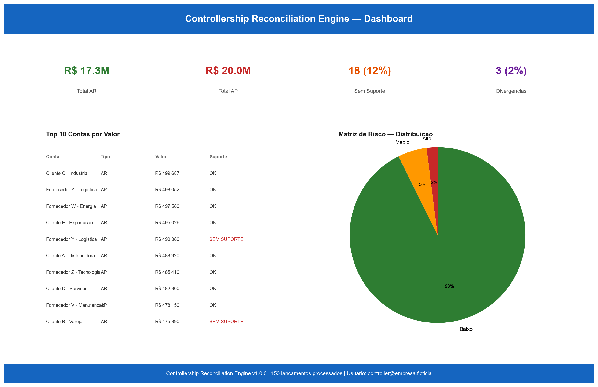
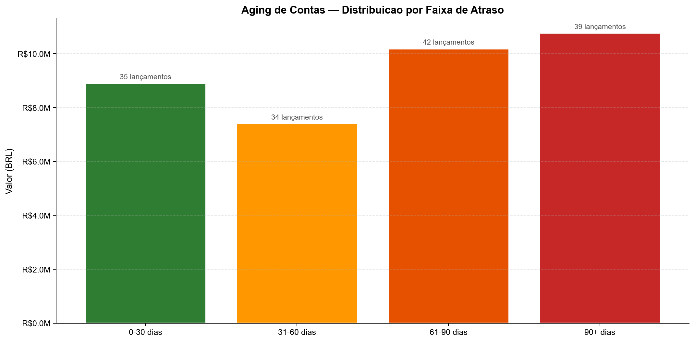
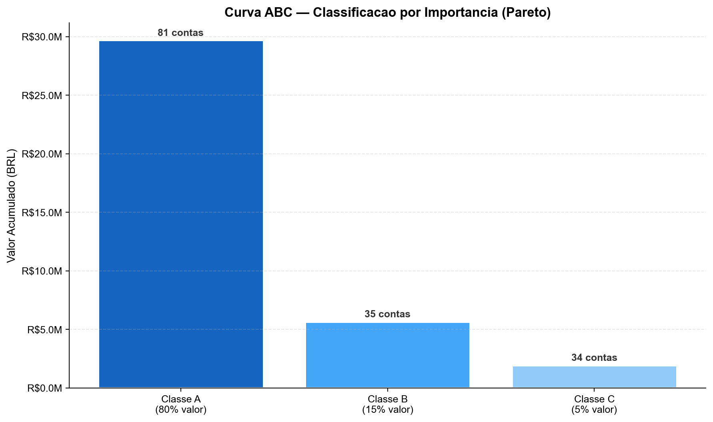
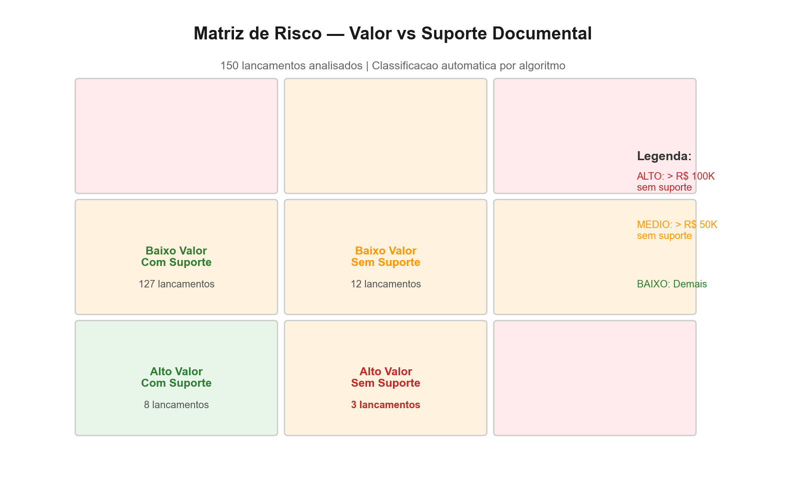

# Resultados — Controllership Reconciliation Engine

---

## Caso 1 — Holding Multissetorial

**Perfil:** Holding com 8 subsidiárias, 45 contas bancárias, 12.000+ lançamentos mensais.

**Dor:**
- Conciliação bancária manual em 45 contas levava 5 dias
- 23% dos lançamentos AP sem suporte documental
- Auditoria externa encontrou R$ 2,1M em divergências não explicadas

**Resultados:**

| Métrica | Antes | Depois |
|---|---|---|
| Conciliação AR/AP | 3 dias | 4 horas |
| Lançamentos sem suporte | 23% | 4% |
| Divergências bancárias | 12% | 1,5% |
| Tempo de auditoria | 2 semanas | 3 dias |

---

## Métricas Agregadas

```
Conciliacao AR/AP:       ████░░░░░░░░░░░░░░░░  -94%
Lancamentos sem suporte: ███░░░░░░░░░░░░░░░░░  -83%
Divergencias bancarias:  ████████░░░░░░░░░░░░  -87%
Tempo de auditoria:      ███████░░░░░░░░░░░░░  -78%
```

---

## Screenshots

### Dashboard AR/AP Executivo


### Aging de Contas


### Curva ABC


### Matriz de Risco

